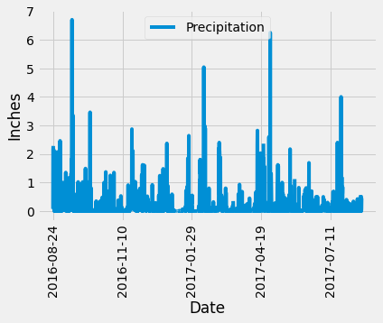
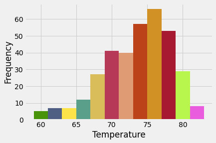
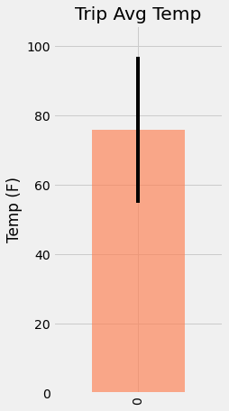
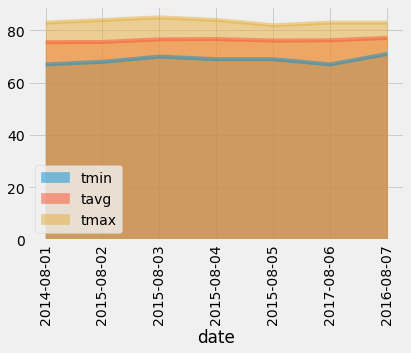

# Analysis with SQLAlchemy
### Climate Analysis and Exploration
Performed Climate Analysis and data exploration using `Python` and `SQLAlchemy` ORM queries using a [hawaii.sqlite](Resources/hawaii.sqlite) file.

#### Precipitation Analysis
Query the last 12 Months of Precipitation data and generated a line Plot of the results.

 
#### Station Analysis
Performed the following queries to obtain more detail information about the dataset:
* Query the total number of stations in the dataset
* Query the most active stations
* Query station with the highest number of observations
* Query the lowest, highest and average temperature for the most active station.
* Histogram Plot with the temperature observations in the last 12 months.

#### Climate App
Designed a `Flask` API based on previous developed queries. Used Flask `jsonify` to convert the API data into a valid JSON response object.

For this app several routes where created:

* `/`

  * Home page.

  * List all routes that are available.

* `/api/v1.0/precipitation`

  * Return a JSON representation of the precipitation values from the dataset.

* `/api/v1.0/stations`

  * Return a JSON list of stations from the dataset.

* `/api/v1.0/tobs`

  * Return a JSON list of temperature observations (TOBS) for the previous year.

* `/api/v1.0/<start>` and `/api/v1.0/<start>/<end>`

  * Return a JSON list of the minimum, average and max temperature for a given start or start-end range date.

### Temperature Analysis

#### Temperature Analysis II
Performed a t-test using the Hawaii temperatures from the dataset for the Months of June and December and determined that the difference in the means are statistically significant.

#### Temperature Analysis II
Created a user function called `calc_temps` that taking a date range as an argument would return the minimum, average and maximum temperatures for that range of dates.
Bar Chart with Y error was plotted using the Avg temperature as the bar Y value and the difference of Max and Min temperature as y error bar (YERR).

##### Daily Rainfall Average
The following task were performed in this analysis:

* Calculated the total precipitation data for a specific date range from a previous year to be used as historical data for a trip that is planed on current year.
* Created a user function called `daily_normals` that taking a date range as an argument would return a DataFrame of the min, avg and max temperatures based on the month and day only. 
* A beautiful area plot was generated to show the findings.

